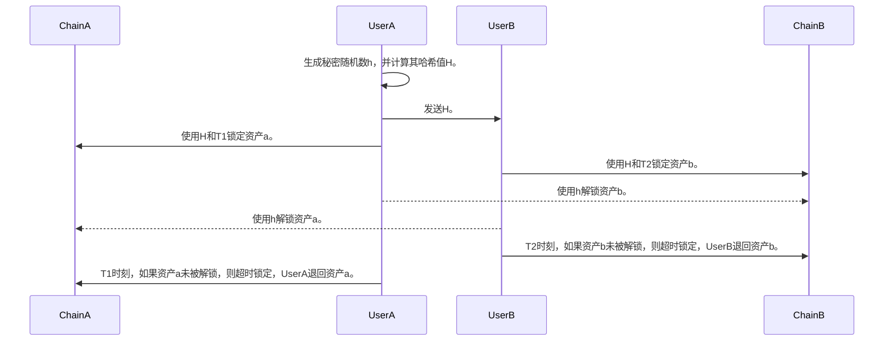

# HTLC

## HTLC原理

哈希时间锁定基于哈希锁和时间锁，特别适合区块链资产交换的场景，假如有两个区块链ChainA和ChainB，ChainA上面有UserA，ChainB上面有UserB，UserA有资产a，UserB有资产b，UserA与UserB想交换资产a与b，那么哈希时间锁定的原理流程如下：

- UserA选取一个秘密随机数h，计算出h的哈希值H，UserA将H发送给UserB，且UserA与UserB定义两个时间点T1和T2，且T1>T2。
- UserA基于H和T1时间，在ChainA上面创建资产锁定合约ContractA，该合约会锁定资产a，可以使用h来解锁并将资产a转移给UserB，如果在T1前仍未解锁，则可以撤销锁定，且不会发生资产转移。
- UserB基于H和T2时间，在ChainB上面创建资产锁定合约ContractB，该合约会锁定资产b，可以使用h来解锁并将资产b转移给UserA，如果在T2前仍未解锁，则可以撤销锁定，且不会发生资产转移。
- UserA使用秘密随机数h，调用ChainB上的智能合约，将资产b转移给UserA。
- 此时，UserB得到了秘密随机数h，B使用h调用ChainA上的智能合约ContractB，将资产a转移给UserB，资产交换完成。
- 如果UserA在T2时间点未执行操作，则T2时间点，b资产超时锁定，T1时刻a资产超时锁定，交易不会发生，还原初识状态。

